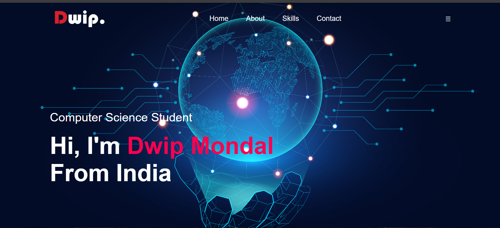

## Dwip Mondal - portfolio
Welcome to my portfolio repository! This project showcases my personal portfolio website which highlights my skills, education, projects, and ways to contact me.
## Dwip Mondal - portfolio
Welcome to my portfolio repository! This project showcases my personal portfolio website which highlights my skills, education, projects, and ways to contact me.
## Screenshots




## Table of Contents

- [Introduction](#introduction)
- [Features](#features)
- [Technologies Used](#technologies-used)
- [Usage](#usage)
- [Contributing](#contributing)
- [License](#license)

## Introduction

This portfolio website is designed to present my background, skills, and projects in a professional manner. It includes sections such as About Me, Skills, and Contact Information.
## Features

- **Home Section:** Introduction and welcome message.
- **About Section:** Brief information about me, including education.
- **Skills Section:** List of my skills with progress bars.
- **Contact Section:** Contact form and social media links.

## Technologies Used

- HTML
- CSS
- JavaScript
- Boxicons
- Google Sheets (for form submission)
## Usage

To view and use this portfolio website, follow these steps:

1. Clone the repository:
    ```bash
    git clone https://github.com/DwipMondal18/portfolio.git
    ```

2. Open the `index.html` file in your web browser to view the portfolio.

## Contributing

If you would like to contribute to this project, please follow these steps:

1. Fork the repository.
2. Create a new branch:
    ```bash
    git checkout -b feature/YourFeatureName
    ```
3. Make your changes and commit them:
    ```bash
    git commit -m 'Add some feature'
    ```
4. Push to the branch:
    ```bash
    git push origin feature/YourFeatureName
    ```
5. Open a pull request and provide a detailed description of your changes.
## License

This project is licensed under the MIT License. See the [LICENSE](LICENSE) file for more details.

---

© 2024-2025 Dwip Mondal. All rights reserved.
